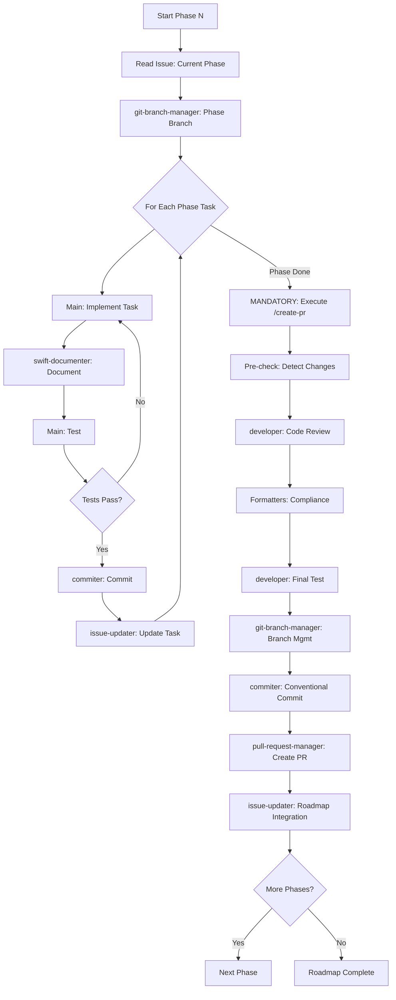

# Implement Roadmap with Agentic Workflow

## Usage

```txt
/implement-roadmap ISSUE_NUMBER [PHASE_NUMBER]
```

Where:

- `ISSUE_NUMBER` is the GitHub issue number containing the roadmap tasks (e.g.,
  `11`, `15`)
- `PHASE_NUMBER` (optional) specifies which phase to implement (e.g., `0`, `1`,
  `2`).
  If omitted, implements the next uncompleted phase.

## Overview

This per-phase roadmap implementation leverages specialized Claude Code agents
for focused development,
ensuring better context management, incremental progress, and reviewable PRs.
Each phase is implemented
and merged separately, allowing for continuous integration and reduced risk.

## Implementation Strategy

### IMPORTANT: Per-Phase Approach

**Each phase is implemented separately with its own PR**. This ensures:

- Smaller, reviewable pull requests
- Incremental progress tracking
- Reduced risk and easier rollback
- Continuous integration of changes

### Phase 0: Initial Setup

1. **Read the GitHub issue** to identify:
   - Current phase status from the Status section
   - Next uncompleted phase to implement
   - Tasks specific to that phase only

2. **Branch Management** - Use the **git-branch-manager agent**:
   - Create phase-specific branch: `roadmap/{issue-number}-phase-{phase-number}`
   - Example: `roadmap/13-phase-0` for Phase 0 of issue #13
   - Ensure branch is properly tracked and pushed

### Phase-Specific Implementation

For the **current phase only**:

1. **Mark task as in progress** by updating the GitHub issue with progress
  comments

2. **Implementation based on task type**:

   #### For Database/Migration Tasks

   - Implement SQL migrations in Palette target
   - Run `sqlfluff lint --dialect postgres .` and fix all issues
   - Update ERD with `./scripts/visualize-postgres.sh`

   #### For Service/API Tasks

   - Implement service layer code
   - Create/update DTOs and controllers
   - Update OpenAPI specifications

   #### For Frontend Tasks

   - Implement Elementary components
   - Add client-side validation
   - Update UI interactions

3. **Documentation** - Use the **swift-documenter agent** for comprehensive
  documentation:

- Add comprehensive DocC comments to all public APIs
- Include usage examples and parameter descriptions

1. **Testing Phase**:
   - Write Swift Testing tests (no XCTest)
   - **MANDATORY**: Run `swift test` and ensure ALL tests pass with exit code 0
   - **CRITICAL**: If tests fail or hang, fix all issues before proceeding

2. **Commit Management** - Use the **commiter agent** for commits:
   - Validates all changes and runs tests
   - Creates conventional commit with proper format
   - Returns commit SHA for tracking
   - Update roadmap with commit SHA

3. **Tracking Updates** - Use the **issue-updater agent** to update GitHub
  issue:

- Updates issue with commit SHA
- Mark task as completed with checkbox updates
- Report progress status and link commits

### Phase Completion: Quality Assurance & PR Creation

1. **Quality validation** (for current phase only):
   - Run `swift build` - no errors allowed
   - Run `swift test` - must exit with code 0
   - Run `./scripts/validate-markdown.sh --fix` on any markdown changes

2. **Branch synchronization** - Use the **git-branch-manager agent**:
   - Rebase on latest main if needed
   - Resolve any conflicts
   - Push updates to remote

3. **MANDATORY: Execute `/create-pr` Command**:
   - **CRITICAL**: Run the full `/create-pr` workflow from
     `.claude/commands/create-pr.md`
   - This includes all 8 steps with specialized agents:
     - Pre-check: Detect Swift file changes
     - Code review with developer agent
     - Format compliance with swift-formatter and markdown-formatter agents
     - Final test verification with developer agent
     - Branch management with git-branch-manager agent
     - Commit creation with commiter agent
     - PR creation with pull-request-manager agent
     - Roadmap integration with issue-updater agent

4. **Phase-Specific PR Requirements**:
   - Title format: `[Roadmap] {RoadmapName} - Phase {N}: {PhaseName}`
   - Example: `[Roadmap] HTTPHeaderAuth - Phase 0: Research`
   - **CRITICAL**: Use "Related to #{issue}" NOT "Fixes #{issue}" (except for
     final phase)
   - Include all quality gates verification from `/create-pr`

5. **PR Description Template**:

   ```markdown
   ## Summary
   Implements Phase {N}: {PhaseName} for {RoadmapName} roadmap

   Related to #{issue}  <!-- Use "Fixes #{issue}" only for final phase -->

   ## Completed Tasks
   - ✅ [List completed tasks from this phase]

   ## Test Status
   All tests pass with `swift test`

   ## Next Phase
   Phase {N+1}: {NextPhaseName} ready to implement after merge
   ```

6. **Post-PR Issue Updates**:
   - Issue updates handled by `/create-pr` workflow
   - Update Status section with phase completion
   - **CRITICAL**: Update Phase Tracking table with branch, commits, PR link,
     and status
   - Check off completed tasks for this phase only
   - Add comment with PR link and commit SHAs

## Agent Coordination Flow (Per Phase)



## Quality Gates Per Phase

### Phase Start Gates

- ✅ Issue read and current phase identified
- ✅ Phase-specific branch created (git-branch-manager)
- ✅ Phase tasks understood and scoped

### Per-Task Gates (Within Phase)

- ✅ Task implementation complete
- ✅ Documentation added (swift-documenter)
- ✅ Tests written and passing
- ✅ Commit created with SHA (commiter)
- ✅ Issue task checked off (issue-updater)

### Phase Completion Gates

- ✅ All phase tasks completed
- ✅ Branch synchronized (git-branch-manager)
- ✅ `swift test` passes
- ✅ Build has no errors
- ✅ Formatting validated
- ✅ **MANDATORY**: `/create-pr` workflow executed completely

### Phase PR Gates (via `/create-pr` workflow)

- ✅ Pre-check: Changes detected and analyzed
- ✅ Code review completed (developer agent)
- ✅ Format compliance verified (swift-formatter & markdown-formatter agents)
- ✅ Final test verification passed (developer agent)
- ✅ Branch management completed (git-branch-manager agent)
- ✅ Conventional commit created (commiter agent)
- ✅ PR created with "Related to #" (pull-request-manager agent)
- ✅ Roadmap integration completed (issue-updater agent)
- ✅ All quality gates from `/create-pr` met
- ✅ PR merged before starting next phase

## Agent Usage Examples

### git-branch-manager for Phase Branch

```bash
Use the git-branch-manager agent to create branch roadmap/13-phase-0 for Phase 0 implementation
```

### issue-updater for Phase Progress

```bash
Use the issue-updater agent to update issue #13 Status section and Phase Tracking table:
- Mark Phase 0 status as ✅ Complete
- Add branch name: roadmap/13-phase-0
- Add commit SHAs: abc123f, def456g
- Add PR link: #145
- Update merged status when PR is merged
```

### swift-documenter for Documentation

```bash
Use the swift-documenter agent to add DocC documentation for the new authentication service
```

### commiter for Commits

```bash
Use the commiter agent to create conventional commit for completed authentication tasks
```

### issue-updater for Updates

```bash
Use the issue-updater agent to update issue #123 with commit SHA abc123
```

### pull-request-manager for Phase PR

```bash
Use the pull-request-manager agent to create PR "[Roadmap] HTTPHeaderAuth - Phase 0: Research" related to issue #13
```

## Benefits of Per-Phase Approach

1. **Incremental Progress**: Each phase delivers value independently
2. **Smaller PRs**: Easier to review and less risky to merge
3. **Continuous Integration**: Changes integrated regularly, not all at once
4. **Better Tracking**: Clear visibility of which phase is active
5. **Reduced Context**: Each PR focuses on one phase's concerns
6. **Easier Rollback**: Problems isolated to specific phase changes

## Error Handling with Agents

If any agent fails:

1. The failure is isolated to that agent's context
2. Main thread remains clean for debugging
3. Can retry specific agent task without losing progress
4. Each agent provides specific error recovery steps

## Phase Completion Criteria

A phase is complete when:

- ✅ All phase tasks checked in GitHub issue
- ✅ Phase commit SHAs recorded in issue comments
- ✅ **Phase Tracking table updated** with branch, commits, PR link, and status
- ✅ Phase PR created with "Related to #" (not "Fixes #")
- ✅ Tests pass with `swift test`
- ✅ PR reviewed and merged
- ✅ Issue Status section updated
- ✅ Phase Tracking table shows ✅ Merged status

## Roadmap Completion Criteria

The entire roadmap is complete when:

- ✅ All phases implemented and merged
- ✅ Final PR uses "Fixes #{issue}" to close issue
- ✅ All tasks across all phases checked
- ✅ Full test suite passes
- ✅ Issue automatically closed by final PR

## CRITICAL REQUIREMENTS

- **NEVER** skip test verification at any step
- **ALWAYS** implement one phase at a time
- **MANDATORY**: Execute `/create-pr` workflow after each phase completion
- **CRITICAL**: `/create-pr` includes all 8 steps with specialized agents
- **CRITICAL**: Use "Related to #{issue}" for all PRs except final
- **MANDATORY**: Only use "Fixes #{issue}" on the final phase PR
- **CRITICAL**: Tests must pass before any commit
- **MANDATORY**: Run `swift test` after each phase
- **MANDATORY**: All quality gates from `/create-pr` must pass
- Each task gets its own commit (via commiter agent)
- Update GitHub issue Status section after each phase (via issue-updater agent)
- Wait for PR merge before starting next phase

## PR Linking Rules

| Phase | PR Title Format | Issue Reference |
| ------- | ---------------- | ----------------- |
| Phase 0-N (not final) | `[Roadmap] Name - Phase N: Title` | `Related to #{issue}` |
| Final Phase | `[Roadmap] Name - Phase N: Title` | `Fixes #{issue}` |

This per-phase approach ensures incremental delivery, reduced risk, and
continuous integration
while maintaining high quality through specialized agent delegation.
